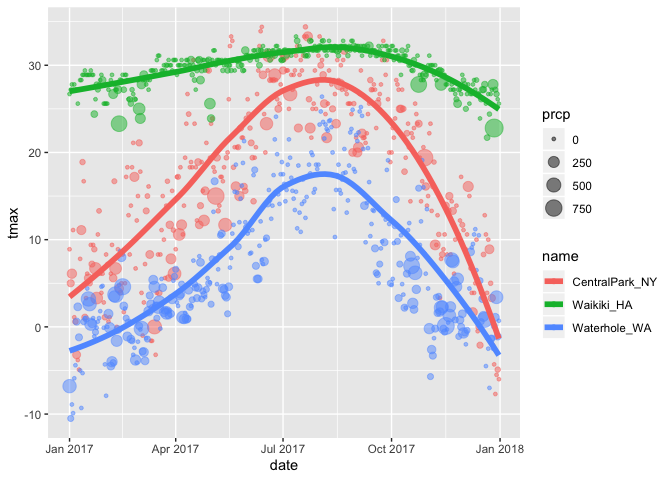
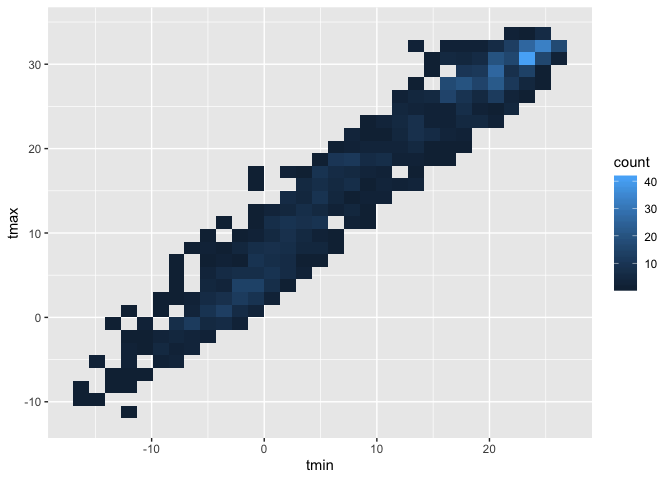
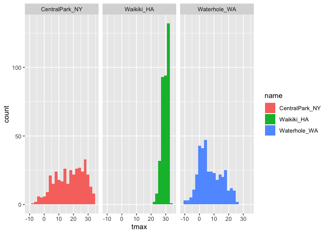
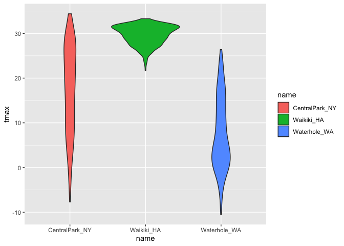
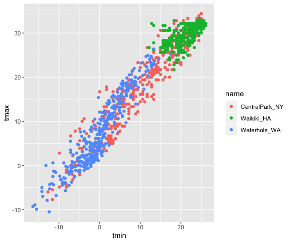
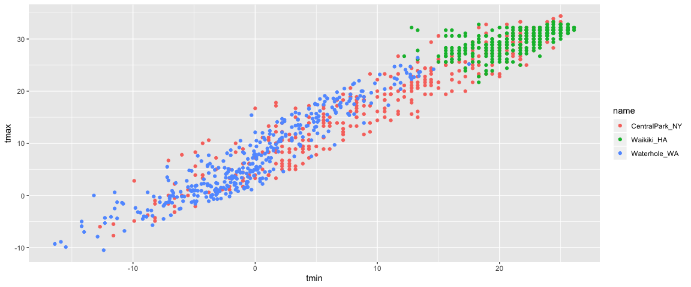
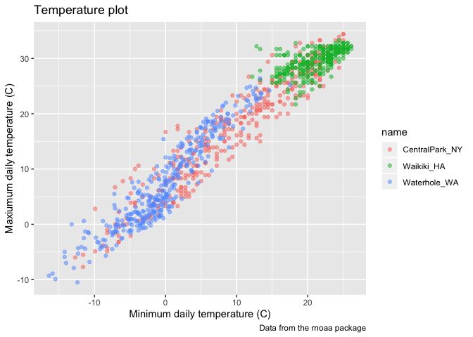
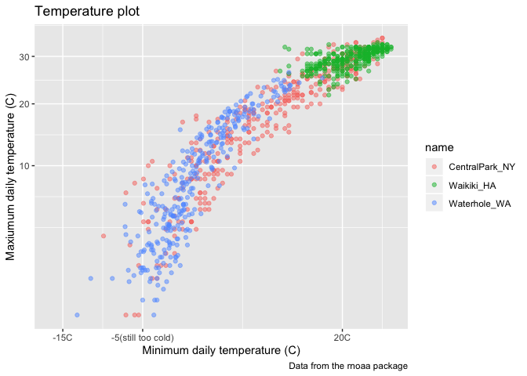

ggplot\_2
================
Clement Mugenzi
9/26/2019

``` r
weather_df = 
  rnoaa::meteo_pull_monitors(c("USW00094728", "USC00519397", "USS0023B17S"),
                      var = c("PRCP", "TMIN", "TMAX"), 
                      date_min = "2017-01-01",
                      date_max = "2017-12-31") %>%
  mutate(
    name = recode(id, USW00094728 = "CentralPark_NY", 
                      USC00519397 = "Waikiki_HA",
                      USS0023B17S = "Waterhole_WA"),
    tmin = tmin / 10,
    tmax = tmax / 10) %>%
  select(name, id, everything())
```

    ## Registered S3 method overwritten by 'crul':
    ##   method                 from
    ##   as.character.form_file httr

    ## Registered S3 method overwritten by 'hoardr':
    ##   method           from
    ##   print.cache_info httr

    ## file path:          /Users/clementmugenzi/Library/Caches/rnoaa/ghcnd/USW00094728.dly

    ## file last updated:  2019-09-03 20:39:20

    ## file min/max dates: 1869-01-01 / 2019-09-30

    ## file path:          /Users/clementmugenzi/Library/Caches/rnoaa/ghcnd/USC00519397.dly

    ## file last updated:  2019-09-03 20:39:33

    ## file min/max dates: 1965-01-01 / 2019-09-30

    ## file path:          /Users/clementmugenzi/Library/Caches/rnoaa/ghcnd/USS0023B17S.dly

    ## file last updated:  2019-09-03 20:39:37

    ## file min/max dates: 1999-09-01 / 2019-09-30

``` r
view(weather_df)
```

## Create ggplot

``` r
ggplot(weather_df, aes(x = tmin, y = tmax)) +
  geom_point()
```

    ## Warning: Removed 15 rows containing missing values (geom_point).

<!-- -->

alternative way of making this plot

``` r
weather_df %>% 
  ggplot(aes(x = tmin, y = tmax)) +
  geom_point()
```

    ## Warning: Removed 15 rows containing missing values (geom_point).

<!-- -->

saving initial plot: mostly i dont use this

``` r
scatterplot = 
  weather_df %>% 
  ggplot(aes(x = tmin, y = tmax)) +
  geom_point()

scatterplot
```

    ## Warning: Removed 15 rows containing missing values (geom_point).

<!-- -->

adding color

``` r
weather_df %>% 
  ggplot(aes(x = tmin, y = tmax)) +
  geom_point(aes(color = name), alpha = .4) # alpha is for transparancy
```

    ## Warning: Removed 15 rows containing missing values (geom_point).

<!-- -->

why do `aes` positions matter?

``` r
weather_df %>% 
  ggplot(aes(x = tmin, y = tmax, color = name)) +
  geom_point(alpha = .4) +
  geom_smooth(se = F) # se makes the plot cleaner
```

    ## `geom_smooth()` using method = 'loess' and formula 'y ~ x'

    ## Warning: Removed 15 rows containing non-finite values (stat_smooth).

    ## Warning: Removed 15 rows containing missing values (geom_point).

<!-- -->

facets

``` r
weather_df %>% 
  ggplot(aes(x = tmin, y = tmax, color = name)) +
  geom_point(alpha = .4) +
  geom_smooth(se = F) +
  facet_grid(~name)
```

    ## `geom_smooth()` using method = 'loess' and formula 'y ~ x'

    ## Warning: Removed 15 rows containing non-finite values (stat_smooth).

    ## Warning: Removed 15 rows containing missing values (geom_point).

<!-- -->

this is fine. but not interesting

``` r
weather_df %>% 
  ggplot(aes(x = date, y = tmax, color = name)) +
  geom_point(aes(size = prcp), alpha = .5) +
  geom_smooth(size = 2, se = F)
```

    ## `geom_smooth()` using method = 'loess' and formula 'y ~ x'

    ## Warning: Removed 3 rows containing non-finite values (stat_smooth).

    ## Warning: Removed 3 rows containing missing values (geom_point).

<!-- -->

## Some extra stuff

``` r
weather_df %>% 
  ggplot(aes(x = date, y = tmax, color = name)) +
  geom_smooth(size = 2, se = F)
```

    ## `geom_smooth()` using method = 'loess' and formula 'y ~ x'

    ## Warning: Removed 3 rows containing non-finite values (stat_smooth).

<!-- -->

2d density

``` r
weather_df %>% 
  ggplot(aes(x = tmin, y = tmax)) +
  geom_bin2d()
```

    ## Warning: Removed 15 rows containing non-finite values (stat_bin2d).

<!-- -->

## More kinds of plots

``` r
# Fill makes sure the bars are filled with colors
weather_df %>% 
  ggplot(aes(x = tmax, fill = name)) +
  geom_histogram(position = "dodge", binwidth = 2) +
  facet_grid(~name)
```

    ## Warning: Removed 3 rows containing non-finite values (stat_bin).

<!-- -->

Density plots\!\!

``` r
weather_df %>% 
  ggplot(aes(x = tmax, fill = name)) +
  geom_density(alpha = .3)
```

    ## Warning: Removed 3 rows containing non-finite values (stat_density).

<!-- -->

``` r
# univariate plots
weather_df %>% 
  ggplot(aes(x = name, y = tmax)) +
  geom_boxplot()
```

    ## Warning: Removed 3 rows containing non-finite values (stat_boxplot).

<!-- -->

``` r
weather_df %>% 
  ggplot(aes(x = name, y = tmax, fill = name)) +
  geom_violin()
```

    ## Warning: Removed 3 rows containing non-finite values (stat_ydensity).

<!-- -->

ridge plots\!\!

``` r
weather_df %>% 
  ggplot(aes(x = tmax, y = name)) +
  geom_density_ridges()
```

    ## Picking joint bandwidth of 1.84

    ## Warning: Removed 3 rows containing non-finite values (stat_density_ridges).

<!-- -->

## saving Plots

``` r
ggp_ridge_temp =
weather_df %>% 
  ggplot(aes(x = tmax, y = name)) +
  geom_density_ridges()

ggsave("ggp_ridge_temp.pdf",
       ggp_ridge_temp)
```

    ## Saving 7 x 5 in image

    ## Picking joint bandwidth of 1.84

    ## Warning: Removed 3 rows containing non-finite values (stat_density_ridges).

``` r
 weather_df %>% 
  ggplot(aes(x = tmin, y = tmax, color = name)) +
  geom_point()
```

    ## Warning: Removed 15 rows containing missing values (geom_point).

<!-- -->

``` r
 weather_df %>% 
  ggplot(aes(x = tmin, y = tmax, color = name)) +
  geom_point()
```

    ## Warning: Removed 15 rows containing missing values (geom_point).

<!-- -->

## Making New plots

start with an old plot

``` r
weather_df %>% 
  ggplot(aes(x = tmin, y = tmax)) + 
  geom_point(aes(color = name), alpha = .5)
```

    ## Warning: Removed 15 rows containing missing values (geom_point).

<!-- -->

Making labels

``` r
weather_df %>% 
  ggplot(aes(x = tmin, y = tmax, color = name)) + 
  geom_point(alpha = .5) + 
  labs(
    title = "Temperature plot",
    x = "Minimum daily temperature (C)",
    y = "Maxiumum daily temperature (C)",
    caption = "Data from the rnoaa package"
  )
```

    ## Warning: Removed 15 rows containing missing values (geom_point).

<!-- -->

x axis ticks marks (to highlight where you wanna focus on your graph)

``` r
weather_df %>% 
  ggplot(aes(x = tmin, y = tmax, color = name)) + 
  geom_point(alpha = .5) + 
  labs(
    title = "Temperature plot",
    x = "Minimum daily temperature (C)",
    y = "Maxiumum daily temperature (C)",
    caption = "Data from the rnoaa package"
  ) +
  scale_x_continuous(
    breaks = c(-15, -5, 20),
    labels = c("-15C", "-5(still too cold)", "20C") # you can do whatever
  ) +
  scale_y_continuous(
    trans = "sqrt"
  )
```

    ## Warning in self$trans$transform(x): NaNs produced

    ## Warning: Transformation introduced infinite values in continuous y-axis

    ## Warning: Removed 90 rows containing missing values (geom_point).

<!-- -->

## Change the default colors

``` r
ggp_base = weather_df %>% 
  ggplot(aes(x = tmin, y = tmax, color = name)) + 
  geom_point(alpha = .5) + 
  labs(
    title = "Temperature plot",
    x = "Minimum daily temperature (C)",
    y = "Maxiumum daily temperature (C)",
    caption = "Data from the rnoaa package"
  ) +
  viridis::scale_color_viridis(
    name = "Location", 
    discrete = TRUE
  )
ggp_base
```

    ## Warning: Removed 15 rows containing missing values (geom_point).

<!-- -->

## themes

``` r
ggp_base +
  theme_minimal() +
  theme(legend.position = "bottom") 
```

    ## Warning: Removed 15 rows containing missing values (geom_point).

<!-- -->

``` r
# to make some space and here order matters a lot
```
